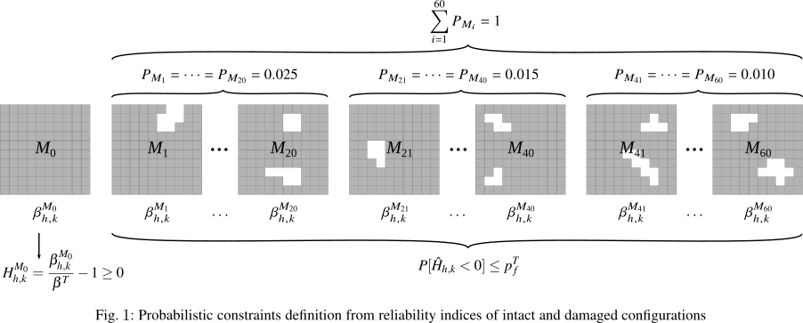
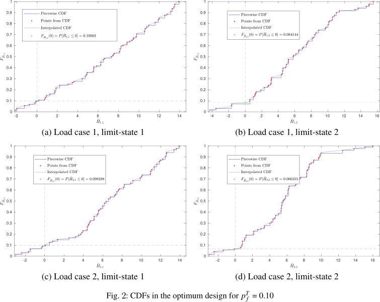

# β-PDFSO

Reliability Index based strategy for the **P**robability **D**amage approach in **F**ail-**S**afe **O**ptimization

The β-PDFSO is a new fail-safe optimization strategy to include available information on the probability of occurrence of different accidental scenarios as well as uncertainty in parameters affecting structural responses. The optimization approach avoids obtaining oversized designs, as the value of the objective function is reduced compared to the fail-safe RBDO. Due to the lack of knowledge of which damaged configuration will occur, a new random reliability index 

is defined for each limit-state of the damaged structure. This new random variable is constructed through the 

in each damaged configuration. The method guarantees 

in the limit-states of the intact configuration and 

in limit-states affecting the damaged structure.

## Example

An optimization problem is defined using mathematical expressions to simulate the objective function 

and the structural responses 
. 
These structural responses are defined by a set of equations, which depend on the design variables 
, 
the random variables 
 
and a vector of coefficients 
, 
as shown in Eq.1, where a response 
 
is defined per load case 
 
and limit-state 
. 
By varying the vector 
 
the structural response 
 
is modified, being possible to obtain a different value for the intact and damaged configurations: the vector 
 
is taken as the unit vector to represent the structural response in the intact model (

), while values between 0 and 1 are used to simulate the response in the damaged configurations (

). By adopting this approach, the structural responses defined in Eq. 1 increase for values of 
 
lower than 1, being possible to simulate a loss of structural capacity in the damaged configurations. In this problem, 
 
was taken as the number of damaged configurations.

The formulation of the optimization problem is presented in Eq. 2. The objective is to minimize the objective function 
, defined as the sum of the design variables 
.
The random variables are defined as normally distributed with mean 

and standard deviation 
. 
The probability of occurrence 
 
of each damaged configuration is shown in Table 1.

The vector of coefficients defined in Eq. 1, 
, 
is set for each load case , 
limit-state  and each model 
, 
expressed as  . Only some values of these coefficients are summarized in the arrays presented in Eq. 3. The full length matrices are available in the matlab file main.m.

The optimization problem was solved for a target reliability index  and a target probability of failure of , which correspond to a confidence level, 
.

## How to use it

Edit the `defineInputParameters` function, where the following inputs are defined:

Problem Parameters       | Description
:-----------------       | :----------
d0                       | Initial value of design varaibles
nDV                      | Number of design variables
nLC                      | Number of load cases
nDcon                    | Number of limit-states
nDamages                 | Number of damaged configurations
pDamages                 | Probability of occurrence of each damaged configuration
pfPDFSO                  | Target probability of failure in the β-PDFSO 
mu_xi                    | mean of the random variable i
sig_xi                   | standard deviation of the random variable i
beta_min                 | target reliability index for RA
resp                     | Structural Response (cell) 
respMax                  | Maximum allowable response (cell)  
GFun                     | Limit state (cell)
Cfd0                     | coefficients for the intact model (cell)
CfDamages                | coefficients for the damaged configurations (cell)
dGFun_dresp              | derivative of GFun with respect to resp
dresp_dxi                | derivative of resp with respect to xi    

Optimization Parameters       | Description
:----------------------       | :----------
lb                            | Lower bounds of design variables
ub                            | Upper bounds of design variables
TolCon                        | Constraint tolerance
TolFun                        | Objective function tolerance
DiffMinChange                 | Minimum finite difference step
DiffMaxChange                 | Maximum finite difference step

## Results

The program generates a CFD plot of each probabilistic constraint and the file opt_results_it.txt.

